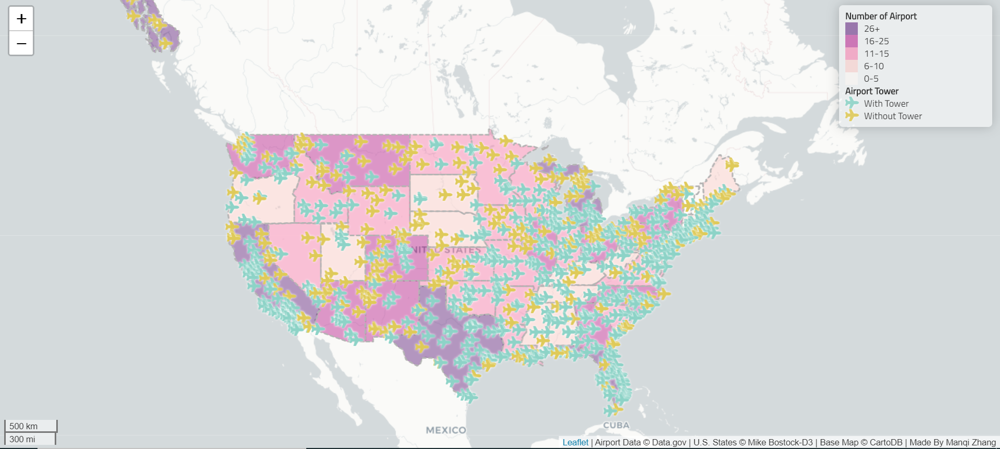

This is a web-map called Airports in the United States that primarily investigates the distribution of the number of airports in various states within the U.S and also explores whether there is a control tower in each airport. There are two main sources we have use in this project, airports data and U.S. states data. Airports data incorporates all the airport information in the United States and it was downloaded and unzipped from the data.gov websites. Another data, US-states data which was extracted from Mike Bostock of D3, is a geojson data file contaning all the states'boundaries of the United States.After acquiring the data, there are several libraries have been used when composing this project. JavaScript libraries will be helped us to read GeoJson data asynchronously. Besides, we also use Chroma.js library to colorize the icon and utilize $ of jQuery to manipulate html elements. Moreover, we also add the source of data and author information at the right bottom corner.

Through this map, we found that most airports in the United States have control towers, most of which are located in the eastern region, and the remaining small part is on the west coast. For those airports without tower, they are located in the central United States

